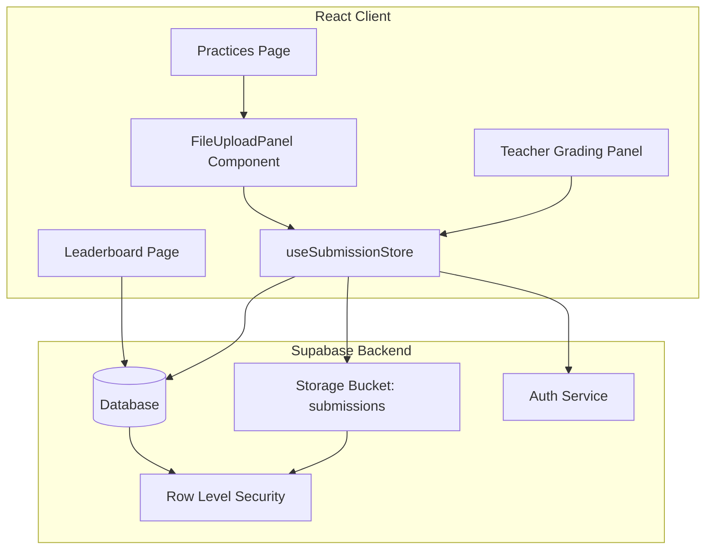
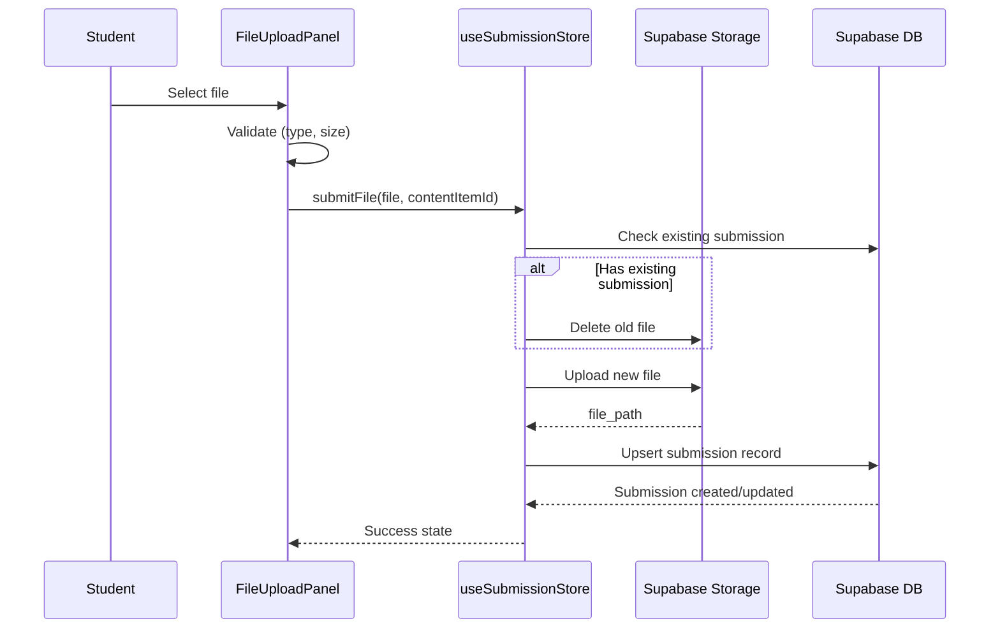

# Design Document: Practice File Upload

## Overview

This design describes the file upload system for practice assignments in DigitalEdu. Students upload Word/PDF files for practice assignments, teachers review and grade them via a dedicated panel, and graded scores contribute to the leaderboard as "File XP".

The system integrates with:
- **Supabase Storage** for file persistence (bucket: `submissions`)
- **Supabase Database** for submission metadata, grading, and RLS-based access control
- **Existing leaderboard_view** which will be extended to include file submission XP
- **Zustand stores** for client-side state management

### Key Design Decisions

1. **Supabase Storage with RLS policies** over a custom file server — leverages existing infrastructure, built-in auth integration, and signed URLs for secure downloads.
2. **Single submissions table with upsert pattern** — unique constraint on (user_id, content_item_id) enforces one-submission-per-assignment naturally, simplifying re-upload logic.
3. **Dedicated Zustand store (`useSubmissionStore`)** — separates file upload concerns from existing stores, following the project's pattern of domain-specific stores.
4. **XP calculated via database view** — extending `leaderboard_view` to include file XP ensures consistency without client-side calculation drift.

## Architecture



### Data Flow



## Components and Interfaces

### New Components

| Component | Location | Purpose |
|-----------|----------|---------|
| `FileUploadPanel` | `src/components/FileUploadPanel.tsx` | File picker, validation, upload progress, status display |
| `SubmissionStatus` | `src/components/SubmissionStatus.tsx` | Displays submission status badge and grade info |
| `GradingPanel` | `src/components/GradingPanel.tsx` | Teacher view: list submissions, download, grade |
| `GradingFilters` | `src/components/GradingFilters.tsx` | Filter controls for grading panel |

### New Store

| Store | Location | Purpose |
|-------|----------|---------|
| `useSubmissionStore` | `src/store/useSubmissionStore.ts` | Manages submission CRUD, file upload, grading |

### Interfaces

```typescript
// src/types/submission.ts

export interface Submission {
  id: string;
  user_id: string;
  content_item_id: string;
  file_path: string;
  file_name: string;
  file_size: number;
  status: 'pending' | 'graded';
  score: number | null;
  feedback: string | null;
  graded_by: string | null;
  graded_at: string | null;
  created_at: string;
  updated_at: string;
}

export interface SubmissionWithProfile extends Submission {
  profiles: {
    full_name: string;
    group_name: string;
    avatar_emoji: string;
  };
  content_items: {
    title: string;
  };
}

export interface FileValidationResult {
  valid: boolean;
  error?: string;
}

export interface GradingFilters {
  status: 'all' | 'pending' | 'graded';
  group: string;
  contentItemId: string;
}
```

### Store Interface

```typescript
// src/store/useSubmissionStore.ts

interface SubmissionState {
  submissions: Submission[];
  teacherSubmissions: SubmissionWithProfile[];
  uploading: boolean;
  uploadProgress: number;
  error: string | null;

  // Student actions
  fetchMySubmission: (contentItemId: string) => Promise<Submission | null>;
  fetchMySubmissions: () => Promise<void>;
  submitFile: (file: File, contentItemId: string) => Promise<{ error: string | null }>;

  // Teacher actions
  fetchSubmissions: (filters: GradingFilters) => Promise<void>;
  getDownloadUrl: (filePath: string) => Promise<string | null>;
  gradeSubmission: (submissionId: string, score: number, feedback?: string) => Promise<{ error: string | null }>;

  // Utilities
  clearError: () => void;
}
```

### Validation Functions (Pure, Testable)

```typescript
// src/lib/fileValidation.ts

export const ALLOWED_EXTENSIONS = ['.doc', '.docx', '.pdf'];
export const MAX_FILE_SIZE = 10 * 1024 * 1024; // 10 MB
export const MAX_FILE_NAME_LENGTH = 255;

export function validateFileExtension(fileName: string): FileValidationResult;
export function validateFileSize(fileSize: number): FileValidationResult;
export function validateFileName(fileName: string): FileValidationResult;
export function validateFile(file: File): FileValidationResult;

// Score validation
export function validateScore(value: unknown): { valid: boolean; score?: number; error?: string };

// XP calculation
export function calculateFileXP(score: number): number;
```

## Data Models

### New Table: `submissions`

```sql
CREATE TABLE IF NOT EXISTS public.submissions (
  id UUID PRIMARY KEY DEFAULT gen_random_uuid(),
  user_id UUID NOT NULL REFERENCES public.profiles(id) ON DELETE CASCADE,
  content_item_id UUID NOT NULL REFERENCES public.content_items(id) ON DELETE CASCADE,
  file_path TEXT NOT NULL,
  file_name TEXT NOT NULL CHECK (length(file_name) <= 255),
  file_size INTEGER NOT NULL CHECK (file_size >= 1 AND file_size <= 10485760),
  status TEXT NOT NULL DEFAULT 'pending' CHECK (status IN ('pending', 'graded')),
  score INTEGER CHECK (score >= 0 AND score <= 100),
  feedback TEXT CHECK (feedback IS NULL OR length(feedback) <= 2000),
  graded_by UUID REFERENCES public.profiles(id),
  graded_at TIMESTAMPTZ,
  created_at TIMESTAMPTZ NOT NULL DEFAULT now(),
  updated_at TIMESTAMPTZ NOT NULL DEFAULT now(),
  UNIQUE (user_id, content_item_id)
);

CREATE INDEX idx_submissions_user ON public.submissions(user_id);
CREATE INDEX idx_submissions_content ON public.submissions(content_item_id);
CREATE INDEX idx_submissions_status ON public.submissions(status);
```

### RLS Policies

```sql
ALTER TABLE public.submissions ENABLE ROW LEVEL SECURITY;

-- Students can view their own submissions
CREATE POLICY "submissions_student_select" ON public.submissions
  FOR SELECT TO authenticated
  USING (auth.uid() = user_id OR public.is_teacher_or_admin());

-- Students can insert their own submissions
CREATE POLICY "submissions_student_insert" ON public.submissions
  FOR INSERT TO authenticated
  WITH CHECK (auth.uid() = user_id);

-- Students can update their own pending submissions (re-upload)
CREATE POLICY "submissions_student_update" ON public.submissions
  FOR UPDATE TO authenticated
  USING (auth.uid() = user_id AND status = 'pending')
  WITH CHECK (auth.uid() = user_id);

-- Teachers/Admins can update any submission (grading)
CREATE POLICY "submissions_teacher_update" ON public.submissions
  FOR UPDATE TO authenticated
  USING (public.is_teacher_or_admin());
```

### Updated Leaderboard View

```sql
CREATE OR REPLACE VIEW public.leaderboard_view AS
SELECT
  p.id AS user_id, p.full_name, p.avatar_emoji, p.group_name, p.diagnostic_score,
  COALESCE(q.total_quiz_xp, 0) AS total_quiz_xp,
  COALESCE(q.total_quizzes, 0) AS total_quizzes,
  COALESCE(q.avg_quiz_percentage, 0) AS avg_quiz_percentage,
  COALESCE(pr.total_practice_xp, 0) AS total_practice_xp,
  COALESCE(pr.total_practices, 0) AS total_practices,
  COALESCE(fs.total_file_xp, 0) AS total_file_xp,
  (COALESCE(q.total_quiz_xp, 0) + COALESCE(pr.total_practice_xp, 0) 
   + COALESCE(fs.total_file_xp, 0) + COALESCE(p.diagnostic_score, 0)) AS total_xp,
  COALESCE(q.unique_topics, 0) AS topics_completed,
  GREATEST(1, FLOOR((COALESCE(q.total_quiz_xp, 0) + COALESCE(pr.total_practice_xp, 0) 
   + COALESCE(fs.total_file_xp, 0) + COALESCE(p.diagnostic_score, 0)) / 100) + 1) AS level,
  p.created_at
FROM public.profiles p
LEFT JOIN (
  SELECT user_id, SUM(xp_earned) AS total_quiz_xp, COUNT(*) AS total_quizzes,
         ROUND(AVG(percentage), 2) AS avg_quiz_percentage,
         COUNT(DISTINCT COALESCE(content_item_id::text, topic_id::text)) AS unique_topics
  FROM public.quiz_results GROUP BY user_id
) q ON q.user_id = p.id
LEFT JOIN (
  SELECT user_id, SUM(xp_earned) AS total_practice_xp, COUNT(*) AS total_practices
  FROM public.practice_results GROUP BY user_id
) pr ON pr.user_id = p.id
LEFT JOIN (
  SELECT user_id, SUM(FLOOR(score * 0.5)) AS total_file_xp
  FROM public.submissions
  WHERE status = 'graded' AND score IS NOT NULL
  GROUP BY user_id
) fs ON fs.user_id = p.id
WHERE p.role = 'student'
ORDER BY total_xp DESC;
```

### Storage Bucket Configuration

- **Bucket name**: `submissions`
- **File path pattern**: `{user_id}/{content_item_id}/{filename}`
- **Allowed MIME types**: `application/pdf`, `application/msword`, `application/vnd.openxmlformats-officedocument.wordprocessingml.document`
- **Max file size**: 10 MB

### Auto-update Trigger

```sql
CREATE OR REPLACE FUNCTION public.update_submission_timestamp()
RETURNS TRIGGER LANGUAGE plpgsql AS $$
BEGIN
  NEW.updated_at = now();
  RETURN NEW;
END;
$$;

CREATE TRIGGER submissions_updated_at
  BEFORE UPDATE ON public.submissions
  FOR EACH ROW EXECUTE FUNCTION public.update_submission_timestamp();
```

## Correctness Properties

*A property is a characteristic or behavior that should hold true across all valid executions of a system — essentially, a formal statement about what the system should do. Properties serve as the bridge between human-readable specifications and machine-verifiable correctness guarantees.*

### Property 1: File extension validation

*For any* file name string, the `validateFileExtension` function SHALL return valid=true if and only if the file name ends with one of `.doc`, `.docx`, or `.pdf` (case-insensitive).

**Validates: Requirements 1.2, 5.6**

### Property 2: File size validation

*For any* positive integer representing file size in bytes, the `validateFileSize` function SHALL return valid=true if and only if the size is between 1 and 10485760 (inclusive).

**Validates: Requirements 1.3, 5.6, 6.4**

### Property 3: Score validation

*For any* input value, the `validateScore` function SHALL return valid=true with the parsed integer if and only if the value is a numeric integer in the range [0, 100] inclusive.

**Validates: Requirements 3.4, 4.5**

### Property 4: Filter correctness

*For any* list of submissions and any combination of filter criteria (status, group, contentItemId), the filter function SHALL return only submissions that match ALL active filter criteria simultaneously, and SHALL include every submission that matches all criteria.

**Validates: Requirements 3.7**

### Property 5: XP calculation consistency

*For any* valid score (integer 0-100), the file XP SHALL equal `Math.floor(score * 0.5)`, and for any sequence of grade updates on the same submission, the final file XP SHALL always equal `Math.floor(latest_score * 0.5)`.

**Validates: Requirements 4.2, 4.4**

### Property 6: Assignment list sort order

*For any* list of practice assignments with submission statuses, the displayed list SHALL be sorted by assignment creation date in descending order (newest first).

**Validates: Requirements 2.3**

### Property 7: One file per student per assignment invariant

*For any* student and any practice assignment, after any sequence of upload operations, there SHALL exist at most one file in the storage bucket at path `{user_id}/{content_item_id}/`.

**Validates: Requirements 5.4**

## Error Handling

| Scenario | User Action | System Response |
|----------|-------------|-----------------|
| Invalid file type | Select non-doc/pdf file | Show error: "Faqat .doc, .docx, .pdf fayllar qabul qilinadi" |
| File too large | Select file > 10MB | Show error: "Fayl hajmi 10 MB dan oshmasligi kerak" |
| Network error during upload | Upload fails mid-transfer | Show error with retry button, retain file reference |
| Session expired | Any authenticated action | Redirect to `/auth` with expired session message |
| File unavailable for download | Teacher clicks download | Show error: "Fayl topilmadi", disable download button |
| Score validation error | Enter invalid score | Show inline error: "Ball 0 dan 100 gacha bo'lishi kerak" |
| No submissions match filter | Apply restrictive filters | Show: "Topshiriqlar topilmadi" |
| Supabase storage error | Upload/download | Show generic error with retry option |

### Error Recovery Strategy

1. **Transient errors** (network, timeout): Show retry button, preserve user input
2. **Auth errors** (401/403): Redirect to auth, preserve navigation state
3. **Validation errors**: Inline display next to the invalid field, prevent submission
4. **Storage errors**: Log to console, show user-friendly message

## Testing Strategy

### Unit Tests (Example-based)

- Component rendering tests (FileUploadPanel, SubmissionStatus, GradingPanel)
- Upload progress UI states
- Error message display for each error scenario
- Session expiry redirect behavior

### Property-Based Tests

**Library**: [fast-check](https://github.com/dubzzz/fast-check) (JavaScript property-based testing library)

**Configuration**: Minimum 100 iterations per property test.

Each property test references its design document property:

| Test | Property | Tag |
|------|----------|-----|
| File extension validation | Property 1 | Feature: practice-file-upload, Property 1: File extension validation |
| File size validation | Property 2 | Feature: practice-file-upload, Property 2: File size validation |
| Score validation | Property 3 | Feature: practice-file-upload, Property 3: Score validation |
| Filter correctness | Property 4 | Feature: practice-file-upload, Property 4: Filter correctness |
| XP calculation | Property 5 | Feature: practice-file-upload, Property 5: XP calculation consistency |
| Sort order | Property 6 | Feature: practice-file-upload, Property 6: Assignment list sort order |

### Integration Tests

- Supabase Storage upload/download with RLS (using test user credentials)
- Unique constraint enforcement on submissions table
- Leaderboard view XP calculation after grading
- RLS policy verification (student can't see others' submissions, teacher can see all)
- Auto-update trigger for `updated_at`

### Test Dependencies to Add

```json
{
  "devDependencies": {
    "fast-check": "^3.15.0",
    "vitest": "^1.6.0",
    "@testing-library/react": "^14.2.0",
    "@testing-library/jest-dom": "^6.4.0"
  }
}
```
